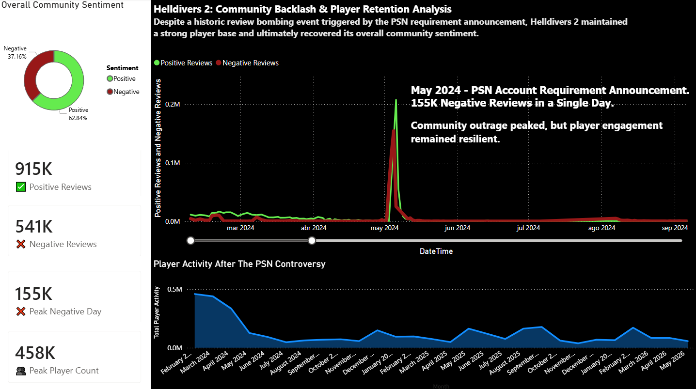

# Helldivers 2 Community Crisis Analysis
## Project Overview

This project analyzes the impact of the May 2024 PlayStation Network (PSN) controversy on the Helldivers 2 community.

Using player activity, review sentiment, and community growth data, the analysis explores how a major public backlash affected player engagement, community sentiment, and overall player retention.

## Business Question

**How did the PSN account requirement controversy impact community sentiment and player retention?**

## Tools Used

* Power BI
* Power Query
* Excel
* Data Cleaning
* Data Visualization

## 📂 Repository Structure

* **dashboard/** → Power BI dashboard
* **data/** → Raw and cleaned datasets
* **documents/** → Project report (PDF)
* **presentation/** → Executive presentation

## Dataset

The analysis combines three datasets:

* **DATASET REVIEWS** – Positive and Negative Reviews
* **DATASET PLAYERS** – Player Activity Metrics
* **DATASET FOLLOWERS** – Community Followers Growth

## Key Findings

* Negative reviews peaked at **155K in a single day** following the PSN announcement.
* Despite the backlash, player activity remained relatively resilient.
* Overall review sentiment remained majority positive (**62.8% positive reviews**).
* The controversy generated significant short-term reputational damage but did not permanently impact the player base.

## Skills Demonstrated

* Data Cleaning
* Data Modeling
* Visual Analytics
* Dashboard Design
* Storytelling with Data
* Business Analysis

## 📊 Dashboard Preview

